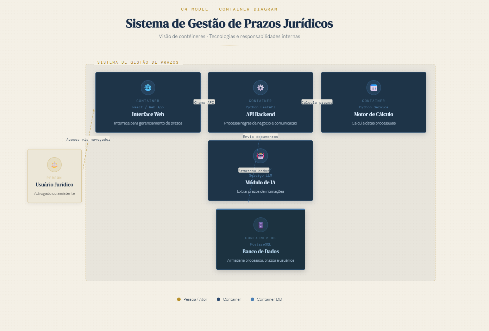

# Sistema Web para Gestão Inteligente de Prazos Jurídicos

## Visão geral
Este projeto está sendo desenvolvido na disciplina PAC Extensionista VII do curso de Engenharia de Software.

A proposta é criar uma plataforma web focada na gestão inteligente de prazos jurídicos, com o objetivo de reduzir falhas humanas, melhorar a organização dos processos e trazer mais segurança no acompanhamento de prazos.

---

## Problema

O controle de prazos processuais ainda é uma atividade crítica em escritórios de advocacia.

Mesmo com o uso de sistemas jurídicos e terceirização, falhas humanas na atribuição de prazos ainda ocorrem, podendo resultar na perda de processos e prejuízos financeiros significativos.

Além disso, muitos sistemas atuais apresentam:
- baixa clareza visual
- excesso de complexidade
- dificuldade de organização por prioridade

---

## Solução proposta

O sistema será desenvolvido com foco em três pilares principais:

- Motor automatizado de cálculo de prazos processuais  
- Análise de intimações em PDF utilizando inteligência artificial  
- Dashboard visual para organização e priorização de prazos  

A proposta é atuar diretamente na redução do risco de perda de prazos.

---

## Validação do problema

A ideia foi validada com profissional da área jurídica com experiência em escritório contendo aproximadamente:

- 5 advogados  
- cerca de 700 processos ativos  

Principais pontos identificados:

- ocorrência de perda de prazos  
- falhas humanas na atribuição de datas  
- dificuldade de organização e visualização  

A solução proposta foi avaliada como altamente relevante (10/10).

---

## Arquitetura inicial

### Diagrama de contexto


---

### Diagrama de containers



---

## Tecnologias previstas

- Python
- FastAPI
- PostgreSQL
- Docker
- GitHub Actions (CI/CD)
- Cloud computing
- Inteligência Artificial para análise de documentos

---

## Estrutura do projeto

```bash
docs/          # documentação do projeto
backend/       # API e regras de negócio
frontend/      # interface do sistema
.github/       # automações e CI/CD
```
---

## Segurança

O sistema será desenvolvido considerando boas práticas de segurança da informação:

- Uso de HTTPS

- Autenticação segura

- Controle de acesso por usuário

- Isolamento de dados entre escritórios

Além disso, o projeto será inspirado nos princípios da ISO 27001.

---

## Status do projeto

Em fase inicial de levantamento de requisitos, validação do problema e definição arquitetural.

---

## Autor

- José Lucas
