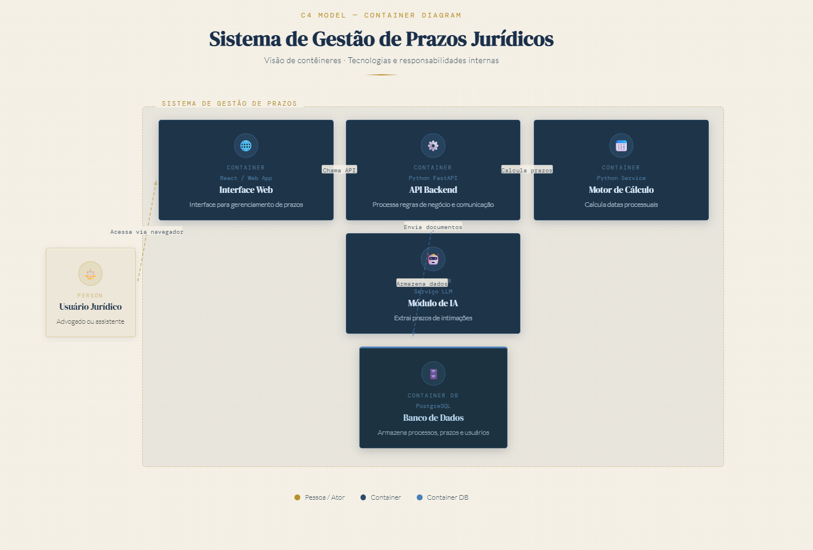

# PrazoAI — Sistema Inteligente de Gestão de Prazos Jurídicos

## Visão geral
Este projeto está sendo desenvolvido na disciplina PAC Extensionista VII do curso de Engenharia de Software.

A proposta é criar uma plataforma web focada na gestão inteligente de prazos jurídicos, com o objetivo de reduzir falhas humanas, melhorar a organização dos processos e trazer mais segurança no acompanhamento de prazos.

---

## Problema

O controle de prazos processuais ainda é uma atividade crítica em escritórios de advocacia.

Mesmo com o uso de sistemas jurídicos e terceirização, falhas humanas na atribuição de prazos ainda ocorrem, podendo resultar na perda de processos e prejuízos financeiros significativos.

Além disso, muitos sistemas atuais apresentam:
- baixa clareza visual
- excesso de complexidade
- dificuldade de organização por prioridade

---

## Solução proposta

O sistema será desenvolvido com foco em três pilares principais:

- Motor automatizado de cálculo de prazos processuais  
- Análise de intimações em PDF utilizando inteligência artificial  
- Dashboard visual para organização e priorização de prazos  

A proposta é atuar diretamente na redução do risco de perda de prazos.

---

## Diferencial do Projeto

Diferente dos sistemas jurídicos tradicionais, o PrazoAI é focado especificamente na gestão inteligente de prazos processuais, utilizando inteligência artificial para análise de intimações em PDF, automação no cálculo de prazos e visualização clara das tarefas prioritárias.

Enquanto muitas plataformas do mercado são mais amplas e generalistas, o PrazoAI concentra sua proposta no ponto mais crítico da rotina jurídica: reduzir falhas humanas e aumentar a segurança no acompanhamento dos prazos.

---

## Validação do problema

A ideia foi validada com profissional da área jurídica com experiência em escritório contendo aproximadamente:

- 5 advogados  
- cerca de 700 processos ativos  

Principais pontos identificados:

- ocorrência de perda de prazos  
- falhas humanas na atribuição de datas  
- dificuldade de organização e visualização  

A solução proposta foi avaliada como altamente relevante (10/10).

---

## Métricas de Sucesso (KPIs)

- Redução de erros no controle de prazos em até 90%
- Aumento da eficiência no cálculo de prazos em até 50%
- Suporte inicial para no mínimo 10 usuários simultâneos
- Taxa de acerto da IA superior a 85%

---

## Arquitetura inicial

### Diagrama de contexto



---

### Diagrama de containers


---

## Tecnologias previstas

- Python
- FastAPI
- PostgreSQL
- Docker
- GitHub Actions (CI/CD)
- Cloud computing
- Inteligência Artificial para análise de documentos

---

## Documentação

- [Proposta Inicial](docs/proposta-inicial.md)
- [Validação do Problema](docs/pesquisa/validacao-problema.md)
- [Requisitos Funcionais](docs/requisitos/requisitos-funcionais.md)
- [Requisitos Não Funcionais](docs/requisitos/requisitos-nao-funcionais.md)
- [Frontend (protótipo navegável) — README](frontend/README.md)

---

## Estrutura do projeto

```bash
docs/          # documentação do projeto
backend/       # API e regras de negócio
frontend/      # interface do sistema
.github/       # automações e CI/CD
```
---

## Segurança

O sistema será desenvolvido considerando boas práticas de segurança da informação:

- Uso de HTTPS

- Autenticação segura

- Controle de acesso por usuário

- Isolamento de dados entre escritórios

Além disso, o projeto será inspirado nos princípios da ISO 27001.

---

## Protótipo — frontend navegável (concluído)

A interface web foi desenvolvida em **React + Next.js + TypeScript (CSS puro)** e está
**navegável e concluída** como protótipo, com foco em clareza visual e priorização de
tarefas. As telas principais já existem e funcionam de ponta a ponta de forma
**demonstrativa**: landing, autenticação e onboarding simulados, dashboard, prazos
(lista, calendário, cadastro/edição/detalhe/conclusão, comentários, anexos e histórico),
intimações (upload, processamento simulado e revisão obrigatória), notificações,
escritório/equipe (permissões, convites, solicitações, transferência e saída), perfil,
configurações e assistente demonstrativo.

A **persistência é local/demonstrativa** (no navegador, via localStorage) — não há
servidor. Detalhes de instalação, execução, testes, credenciais demonstrativas,
funcionalidades e limitações estão no [README do frontend](frontend/README.md).

### Ainda são etapas futuras
- Backend (API) e regras de negócio no servidor
- Banco de dados e persistência real
- Autenticação e autorização reais (sessões, tokens, RBAC no servidor)
- IA/OCR para análise de intimações em PDF
- Cálculo de prazos processuais oficial
- Integrações externas (tribunais, e-mail, Google, etc.)
- Testes de segurança e hardening (ISO 27001, HTTPS, headers)
- Infraestrutura, CI/CD e observabilidade

---

## Status do projeto

Projeto acadêmico da disciplina PAC Extensionista VII. O **protótipo de frontend está
concluído e navegável** (demonstrativo, sem backend). Requisitos e validação do problema
foram levantados nas etapas anteriores.

Próximos passos:
- implementação do backend (API) e do banco de dados
- autenticação/autorização reais e testes de segurança
- motor de cálculo de prazos e análise de intimações com IA/OCR
- integrações externas e infraestrutura (CI/CD, deploy)
- evolução da suíte de testes (incluindo integração e end-to-end)

---

## Autor

- José Lucas Andrade Fonseca
